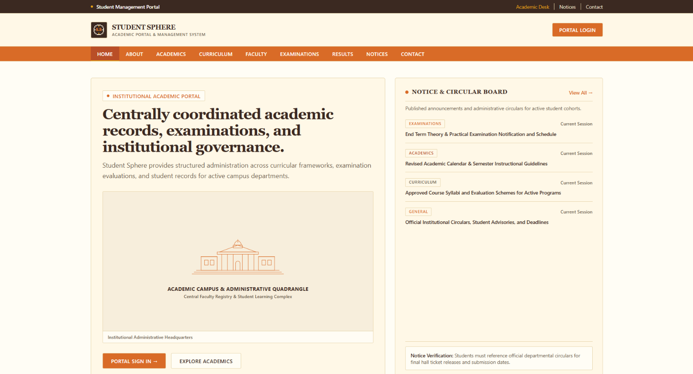
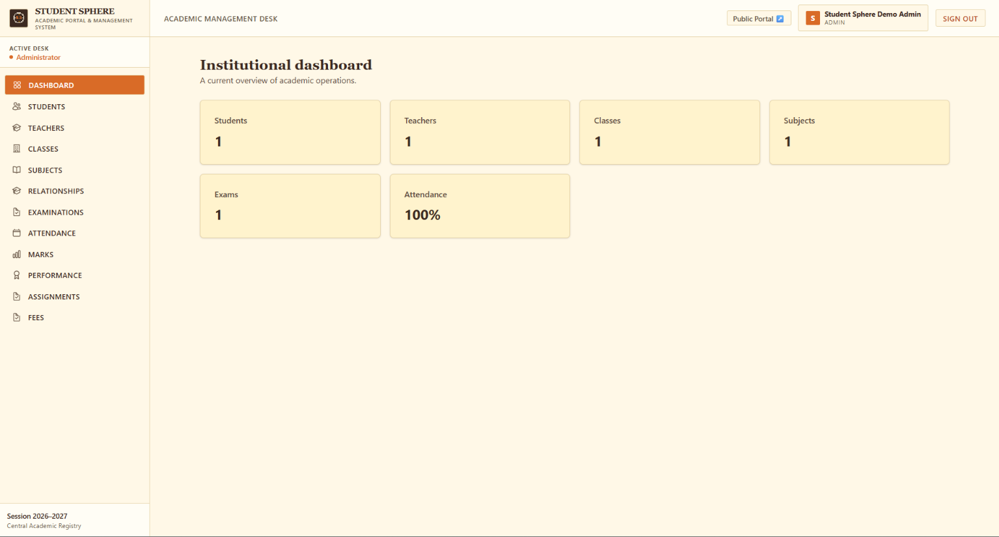
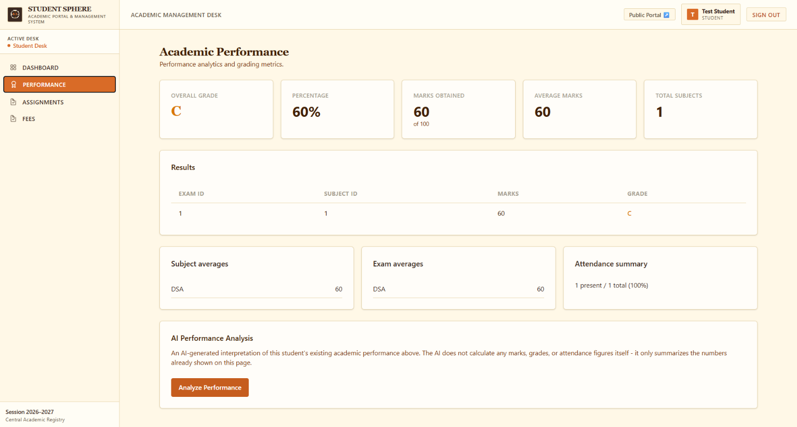
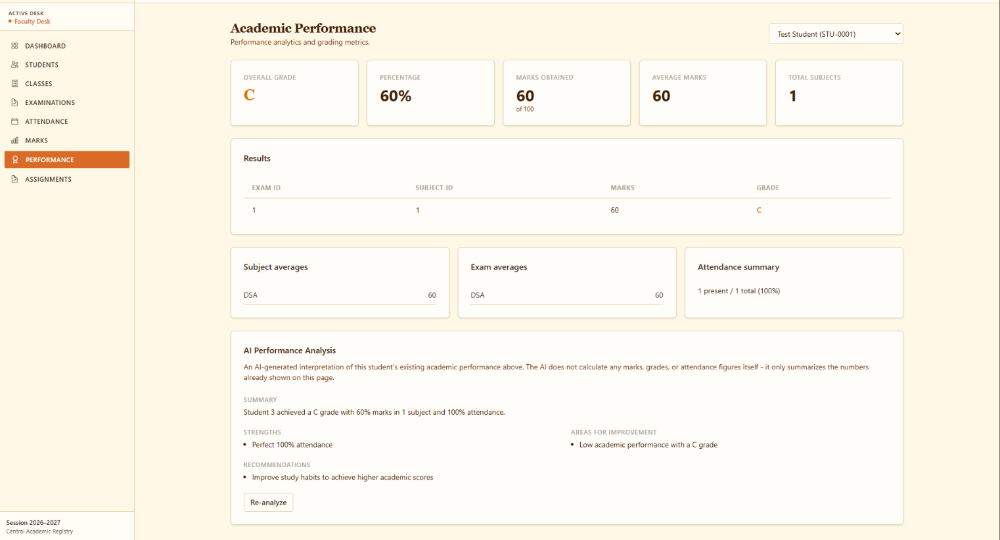
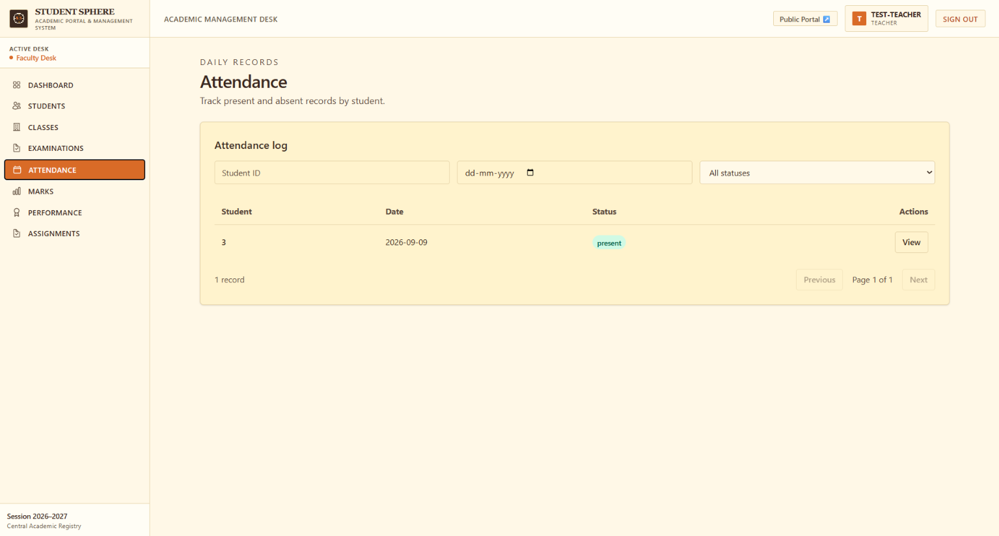
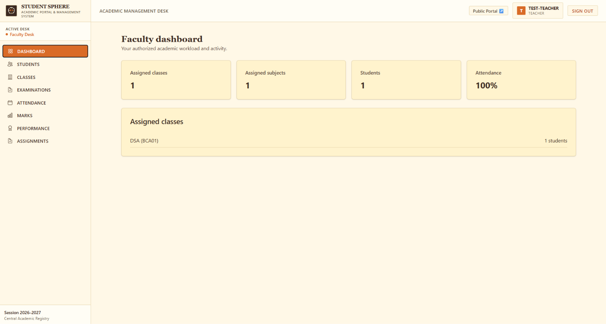

# Student Sphere

### Academic Portal & Management System

Student Sphere is a full-stack academic management platform designed to centralize student records, faculty workflows, attendance, examinations, marks, performance analytics, assignments, fees, and role-based access in one system.

The project was built as a portfolio-quality production application with a modern Next.js frontend, FastAPI backend, PostgreSQL database, automated testing, Docker, CI/CD, and an AI-powered performance analysis feature.

## Live Demo

**Production:** https://student-sphere-ten.vercel.app/

**Backend API:** https://student-sphere-backend-nhg6.onrender.com/

> The production environment uses demo data. Do not use real personal information or production secrets when reproducing the project.

---

## Screenshots

### Public Portal



### Administrator Dashboard



### Academic Performance



### AI Performance Analysis



### Faculty Attendance



### Faculty Dashboard



---

## Overview

Student Sphere models a university/institutional academic environment with separate experiences for:

- **Administrators** — manage the academic registry and institutional data.
- **Teachers** — work with assigned classes, subjects, students, attendance, examinations, marks, and assignments.
- **Students** — view their academic information, performance, assignments, and fees.

The application uses server-side authorization and role-aware frontend navigation so that users only receive the functionality appropriate to their role.

---

## Core Features

### Student Management

- Student creation, editing, deletion, and profile views
- Human-facing Student IDs such as `STU-0001`
- Student login account creation
- Academic class assignment
- Search/filter/pagination support
- Student profile with academic information and marks

### Faculty Management

- Teacher records
- Human-facing Teacher IDs such as `TCH-0001`
- Teacher login accounts
- Teacher/class relationships
- Teacher/subject relationships
- Role-specific faculty dashboard

### Academic Management

- Academic classes
- Subjects
- Subject/class relationships
- Teacher/class and teacher/subject assignments
- Examinations
- Marks
- Attendance
- Grades
- Performance analytics
- Assignments
- Fees

### Performance Analytics

The performance module provides:

- Overall grade
- Percentage
- Marks obtained
- Average marks
- Total subjects
- Subject averages
- Exam averages
- Attendance summary
- Performance result breakdown
- Charts and academic analytics

### AI Performance Analysis

Student Sphere includes an optional AI-powered performance interpretation workflow.

The AI receives an authoritative performance snapshot and produces:

- **Summary**
- **Strengths**
- **Areas for Improvement**
- **Recommendations**

The AI does **not** calculate marks, grades, fees, or attendance itself. Those values come from the application's academic data and calculation logic; the AI interprets the existing information.

The AI integration uses OpenRouter through the backend, keeping the provider API key server-side.

---

## Role-Based Access Control

| Capability | Admin | Teacher | Student |
|---|:---:|:---:|:---:|
| Dashboard | ✓ | ✓ | ✓ |
| Students | ✓ | ✓* | — |
| Teachers | ✓ | — | — |
| Classes | ✓ | ✓* | — |
| Subjects | ✓ | ✓* | — |
| Relationships | ✓ | — | — |
| Examinations | ✓ | ✓* | View* |
| Attendance | ✓ | ✓ | View* |
| Marks | ✓ | ✓ | View* |
| Performance | ✓ | ✓* | ✓ |
| Assignments | ✓ | ✓ | ✓ |
| Fees | ✓ | — | ✓ |

`*` Access is constrained by the user's authorized academic relationships and backend authorization rules.

---

## Architecture

```text
                         Internet
                            │
                            ▼
                  ┌─────────────────────┐
                  │       Vercel        │
                  │  Next.js Frontend   │
                  └──────────┬──────────┘
                             │ HTTPS
                             ▼
                  ┌─────────────────────┐
                  │       Render        │
                  │   FastAPI Backend   │
                  │   Docker Container  │
                  └──────────┬──────────┘
                             │
                             ▼
                  ┌─────────────────────┐
                  │      Supabase       │
                  │     PostgreSQL      │
                  └─────────────────────┘

                 AI requests
                      │
                      ▼
                 OpenRouter
```

For local development, Docker Compose runs the frontend, backend, and PostgreSQL services together.

---

## Technology Stack

### Frontend

- **Next.js 16**
- **TypeScript**
- **Tailwind CSS**
- **shadcn/ui**
- **React Hook Form**
- **Zod**
- **TanStack Query**
- **Recharts**

### Backend

- **FastAPI**
- **Python 3.12**
- **SQLAlchemy 2**
- **PostgreSQL**
- **Alembic**
- **Pydantic**

### Authentication & Security

- JWT authentication
- HTTP-only access-token cookies
- Role-based access control
- Server-side authorization
- Password hashing
- Production secret validation
- Configurable secure cookie behavior
- Security response headers
- Open-redirect protection
- Backend input validation

### Testing & Delivery

- **Pytest**
- **Playwright**
- **Docker**
- **GitHub Actions**
- **Git + GitHub**

### Deployment

- **Vercel** — frontend
- **Render** — backend
- **Supabase** — PostgreSQL
- **OpenRouter** — AI provider

---

## Project Structure

```text
student-management-system/
│
├── backend/
│   ├── app/
│   │   ├── models/
│   │   ├── routers/
│   │   ├── schemas/
│   │   ├── services/
│   │   ├── config.py
│   │   ├── database.py
│   │   ├── security.py
│   │   └── main.py
│   │
│   ├── tests/
│   ├── alembic/
│   ├── alembic.ini
│   ├── Dockerfile
│   ├── requirements.txt
│   └── create_admin.py
│
├── frontend/
│   ├── app/
│   │   ├── (app)/
│   │   └── ...
│   ├── components/
│   ├── lib/
│   │   ├── api/
│   │   ├── hooks/
│   │   └── types/
│   ├── tests/
│   ├── Dockerfile
│   └── package.json
│
├── .github/
│   └── workflows/
│       └── ci.yml
│
├── docker-compose.yml
├── .env.example
└── README.md
```

---

## Authentication

Authentication is implemented in the FastAPI backend.

### Login flow

```text
User
 │
 │ email/identifier + password
 ▼
FastAPI /auth/login
 │
 │ verify credentials
 ▼
Password hash verification
 │
 │ create JWT
 ▼
HTTP-only access_token cookie
 │
 ▼
Authenticated frontend requests
```

The frontend sends authenticated API requests using credentials, while the backend reads and validates the HTTP-only cookie.

The frontend also uses the `/auth/me` endpoint to determine the current session and role.

---

## Authorization

Authentication answers:

> "Who is this user?"

Authorization answers:

> "What is this user allowed to do?"

Student Sphere keeps those concerns separate.

Backend authorization checks are applied to protected resources and relationship-sensitive academic operations. This prevents users from simply changing an ID in a request to access another student's or teacher's data.

Examples include:

- Student access restricted to the appropriate student record
- Teacher access constrained by assigned classes/subjects
- Student/class consistency checks
- Subject/class consistency checks
- Exam/class consistency checks
- Assignment authorization
- Submission/student consistency checks

---

## Database

PostgreSQL is the primary relational database.

The application uses SQLAlchemy for database access and Alembic for schema migrations.

The domain includes entities for:

- Users
- Students
- Teachers
- Academic classes
- Subjects
- Examinations
- Marks
- Attendance
- Assignments
- Fees
- Academic relationships

Human-facing identifiers such as:

```text
ADM-0001
TCH-0001
STU-0001
```

are presentation identifiers derived from internal database records rather than replacing internal primary keys.

---

## API

The backend follows a REST-style API structure using FastAPI routers.

Major resource areas include:

```text
/auth
/dashboard
/students
/teachers
/classes
/subjects
/relationships
/attendance
/examinations
/marks
/grades
/students/{id}/performance
/students/{id}/performance/analysis
/assignments
/fees
```

FastAPI also provides interactive API documentation through its documentation interface.

---

## AI Architecture

The AI workflow deliberately keeps academic calculations outside the AI layer.

```text
PostgreSQL
    │
    ▼
Performance service
    │
    ▼
Authoritative performance snapshot
    │
    ▼
AI analysis service
    │
    ▼
OpenRouter
    │
    ▼
Structured JSON response
    │
    ▼
Frontend AI Performance Analysis
```

The backend validates the provider response before returning it to the frontend.

Provider failures are handled separately from malformed provider responses, allowing the frontend to present appropriate error states.

---

## Testing

Testing was treated as a core part of the project rather than an afterthought.

### Backend

The final backend test suite reached:

```text
471 passed
0 failures
```

The test suite covers areas including:

- Authentication
- Students
- Teachers
- Classes
- Subjects
- Student profiles
- Attendance
- Examinations
- Marks
- Grades
- Performance
- Assignments
- Fees
- Authorization
- Configuration
- AI provider behavior

### Frontend

The production frontend was verified with:

```bash
npm run lint
npx tsc --noEmit
npm run build
```

All checks passed.

The production build generated the application's routes successfully.

### End-to-End

Playwright authentication coverage was also verified, including protected-route and authentication behavior.

### CI

GitHub Actions runs automated backend and frontend checks and builds the Docker images.

---

## Docker

The application can be run locally as a multi-container stack.

Services:

```text
frontend
backend
postgres
```

The database is kept on the internal Docker network rather than being unnecessarily published to the host.

The backend and frontend communicate through the Docker Compose service network.

### Start locally

```bash
docker compose up -d --build
```

### Stop locally

```bash
docker compose down
```

> Do not use `docker compose down -v` unless you intentionally want to delete the PostgreSQL volume and its data.

---

## Environment Variables

Create the required environment configuration from the example file:

```bash
cp .env.example .env
```

Important production values include:

```text
APP_ENV
DATABASE_URL
JWT_SECRET_KEY
JWT_ALGORITHM
ACCESS_TOKEN_EXPIRE_MINUTES
AI_PROVIDER_API_KEY
AI_PROVIDER_BASE_URL
AI_PROVIDER_MODEL
AI_PROVIDER_TIMEOUT_SECONDS
ADMIN_NAME
ADMIN_EMAIL
ADMIN_PASSWORD
```

Secrets should never be committed to Git.

The repository contains only example placeholders and CI test values.

---

## Local Development

### Prerequisites

- Git
- Docker Desktop
- Node.js 22+
- Python 3.12+

### Backend

```bash
cd backend
python -m venv venv
```

Activate the virtual environment and install dependencies:

```bash
pip install -r requirements.txt
```

Apply migrations:

```bash
alembic upgrade head
```

Run the API:

```bash
uvicorn app.main:app --reload
```

### Frontend

```bash
cd frontend
npm ci
npm run dev
```

The frontend development server runs on port `3000` and proxies `/api` requests to the backend.

For the complete containerized environment, Docker Compose is recommended.

---

## CI/CD

The repository uses GitHub Actions.

The CI pipeline validates:

1. Backend dependencies
2. PostgreSQL-backed backend setup
3. Alembic migrations
4. Backend tests
5. Frontend dependencies
6. ESLint
7. TypeScript
8. Production frontend build
9. Docker image builds

This provides a repeatable verification process for changes pushed to the repository.

---

## Deployment

The production deployment separates the application into three hosted layers:

```text
Vercel
  └── Next.js frontend

Render
  └── FastAPI backend container

Supabase
  └── PostgreSQL database
```

The frontend communicates with the backend through HTTPS.

Environment-specific secrets are stored in the hosting providers' environment configuration rather than in the Git repository.

---

## Security Considerations

Student Sphere includes several production-oriented security measures:

- HTTP-only authentication cookies
- JWT expiration
- Production JWT secret validation
- Password hashing
- Backend RBAC
- Relationship-based authorization
- IDOR protection
- Input validation
- Database foreign-key consistency
- Secure cookie configuration
- Security response headers
- Open-redirect protection
- No production API keys committed to Git
- Server-side AI provider credentials
- Same-origin frontend API proxy
- Production environment validation

The application is designed as a portfolio project and should still undergo additional infrastructure and operational review before being used for real institutional student data.

---

## Design System

Student Sphere uses a warm institutional visual language instead of the typical dark/navy administrative dashboard aesthetic.

Primary visual characteristics include:

- Warm cream backgrounds
- Warm white surfaces
- Brown typography
- Orange/amber accents
- Fine beige borders
- Institutional serif headings
- Pixel-art Student Sphere globe and `SS` monogram

The public portal and authenticated management desk share the same visual identity.

---

## What This Project Demonstrates

This project was built to demonstrate practical full-stack engineering rather than only frontend UI development.

It demonstrates experience with:

- Full-stack application architecture
- REST API design
- Relational database modeling
- Authentication
- Authorization and RBAC
- Secure cookie-based sessions
- CRUD workflows
- Academic domain modeling
- Data validation
- React Query data management
- Interactive analytics
- AI API integration
- Automated backend testing
- End-to-end testing
- Docker
- CI/CD
- Cloud deployment
- Production configuration
- Git workflow

---

## Future Improvements

Potential future iterations could include:

- More advanced reporting and exports
- Notification/email workflows
- Richer assignment submission workflows
- More detailed teacher analytics
- Advanced attendance reports
- Document uploads
- Audit logs
- More granular permissions
- Additional AI-assisted academic insights
- Automated backups and operational monitoring
- Stronger production observability

These are intentionally outside the current v1 scope.

---

## Project Status

**Student Sphere v1.0 — Production-ready portfolio release**

Current status:

- ✓ Full-stack application
- ✓ Three-role RBAC
- ✓ Academic management workflows
- ✓ Performance analytics
- ✓ AI performance analysis
- ✓ Automated tests
- ✓ Docker
- ✓ GitHub Actions CI
- ✓ Cloud deployment
- ✓ Production verification
- ✓ Branded Student Sphere identity

---

## License

This project is available for portfolio and educational purposes.

If you plan to reuse the code commercially or deploy it for a real institution, review and define an appropriate license and data-protection policy first.
